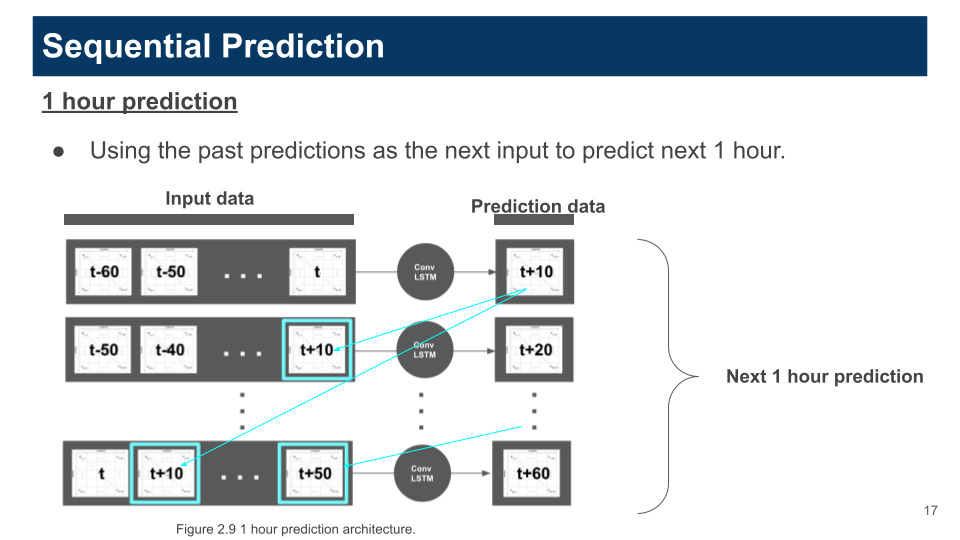
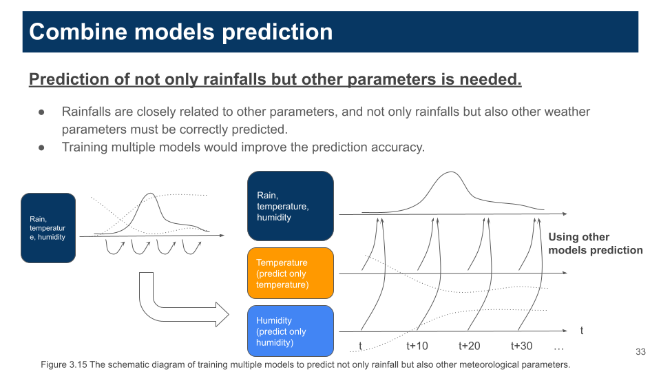

# POTEKA-PIPELINE-PYTORCH

This project is a ML pipeline for managing all steps (preprocessing P-POTEKA
data, training and evaluate pytorch models) of experiments.

See [API documents](https://tsugumi-sys.github.io/ppoteka-rainfall-prediction/)

## Overviews

### Flow of pipeline

1. **Preprocessing:** All P-POTEKA datasets into train, validation and
   evaluation datasets and store its metadata in this process.
2. **Training:** Train and validation datasets, prepared in preprocessing
   process are loaded. Then the target model trained with hyperparameters and
   other parameters defined in configuration files (all configuration are
   managed by `hydra` in `conf/` directory).
3. **Evaluation:** The trained model is evaluated using the evaluation dataset.
   There are 3 types of evaluations.

- [NormalEvaluation](https://tsugumi-sys.github.io/ppoteka-rainfall-prediction/pdoc_contents/evaluate/src/normal_evaluator.html):
  The model's output is the sequences of frames.
- [SequentialEvaluation](https://tsugumi-sys.github.io/ppoteka-rainfall-prediction/pdoc_contents/evaluate/src/sequential_evaluator.html):
  The modle's output is a single frame. The model uses the past predictions to
  predict next frames. 
- [CombineModelsEvaluation](https://tsugumi-sys.github.io/ppoteka-rainfall-prediction/pdoc_contents/evaluate/src/combine_models_evaluator.html):
  The multiple parameter models (like `rain/humidity/temperature`) is trained
  and also single parameter models are trained (`rain`, 'humidity' and
  `temperature` separately) in training process. The single parameter models
  predicts its parameter, like the temperature model predicts temperature. Then,
  these predction results are used when the multiple parameter predicts
  sequentially.
  

### Tools

- `mlflow`: Building pipeline and UI tool.
- `hydra`: Managing hyper parameters and other parameters, e.t.c.
- `torch`: Defining machine learning models.

### Models

All models are difined in `train/src/models`.

- `Seq2Seq`: The sequence to sequence model using ConvLSTM (Shi et al., 2015).
- `SASeq2Seq`: The sequence to sequence model using the base Self-Attention
  ConvLSTM (Lin et al., 2020).
- `SAMSeq2Seq`: The sequence to sequence model using Self-Attention ConvLSTM,
  which Self-Attention Memory module is applied (Lin et al., 2020).

### Other info

- Use `conda` environment for using `cartopy`, which is a library for
  visualizing geo data.
- `Adam` optimizer is used.
- `BCE loss` is used because the output is scaled to [0, 1].
- `RMSE` and `R2Score` is used for evaluation.
- `unittest` is used for unittests.

## Getting Started

### 0. Setup

#### 0-1. Modify `pipeline_root_dir_path` in `conf/config.yaml`

```yaml
// conf/config.yaml

...

###
# Path info
###
pipeline_root_dir_path: your/path
# Put your path. Note that this path should be
# pipeline (poteka-pipeline-pytorch) root, not project root.
# It should be like a/b/poteka-pipeline-pytorch. 

...
```

#### 0-2. Create `secrets` directory and put `secret.yaml`.

```bash
mkdir conf/secrets && touch conf/secrets/secret.yaml
```

#### 0-3. Put secret api token for notification services (If you don't use, put dummy string).

Notification services are used for notifying the end of pipeline.

```yaml
// conf/secrets/secret.yaml

notify_api_token: xxxx (<- put this line)
```

#### 0-4. Place `train_dataset.csv` and `test_dataset.json` in `preprocess/src`.

You can create them automatically via the command in `../poteka-data/Makefile`.
See
[README.md](https://github.com/tsugumi-sys/ppoteka-rainfall-prediction/tree/main/poteka-data#selecting-training-and-test-datasets).

```bash
cd ../poteka-data
make select_train_dataset && make select_test_dataset
```

#### 0-5. Set variables in `./Makefile`

Set `CONDA_ENV_NAME` and `EXPERIMENT_NAME` (mlflow experiment name) and
`MODEL_NAME` (the target model) in `./Makefile`.

```Makefile
// ./Makefile
...
###
# Common parameters
###
CONDA_ENV_NAME = your-conda-env-name
EXPERIMENT_NAME = your-mlflow-experiment-name
MODEL_NAME = SAMSeq2Seq # or Seq2Seq, SASeq2Seq
...
```

#### 0-6. Change parameters in `conf/` and run commands in `Makefile`.

### 1. Run training and evaluation.

##### Test run (training & evaluation) using small datasets for training.

```bash
make test-run
```

##### Training

The trained model and other artifacts and metrics (learning curves, e.t.c) are
saved.

```bash
make train
```

##### Evaluation

First, you need to modify `TRAIN_RUN_ID` in `poteka-pipeline-pytorch/Makefile`.
The `TRAIN_RUN_ID` is generated after `make train` or
`make train_and_evaluation` and you can check it via `make ui` or console logs.

```bash
# poteka-pipeline-pytorch/Makefile  

...
TRAIN_RUN_ID=your-train-id
.PHONY: evaluate
...
```

Execute evaluation process using test dataset. Prediction resutls of metrics and
figures are saved.

```bash
make evaluate
```

##### Training & Evaluation

Runing training and evaluation at one step.

```bash
make train_and_evaluate
```

##### Check results via mlflow UI.

```bash
make ui
```

See comments in the makefile for more information.
